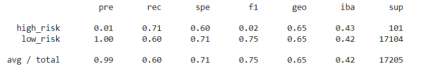
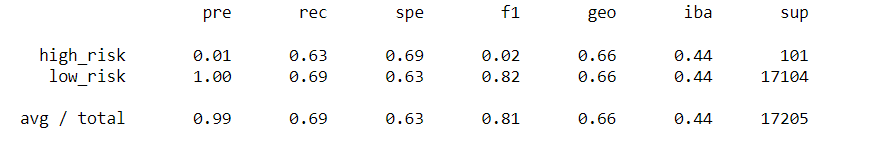
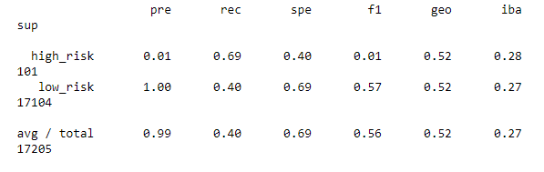
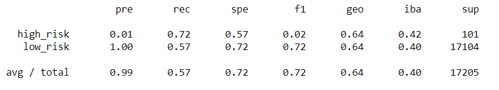
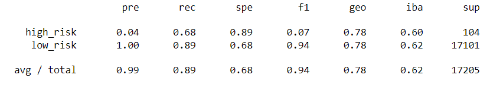
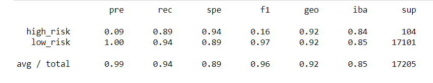

# Credit_Risk_Analysis

## Overview
Credit risk is an inherently unbalanced classification problem, as good loans easily outnumber risky loans. We have been challenged to employ several different techniques to train and evaluate models with unbalanced classes. We have been given a dataset from LendingClub, a peer-to-peer lending services company. Our challenge is to over and undersample the data to evaluate the performance of the models and make a written recommendation on whether they should be used to predict credit risk.

## Analysis

- Using Random Oversampling results we show that balanced accuracy is at 65%. The precision scores for High and Low risk are 0.01% and 1% respectively with recall rates within .10 of each other.

 - SMOTE oversampling gives a very similar result as the Random oversampling model:

After running more tests with Imbalanced, Balanced undersampling, Combination over and under as well as Easy Ensemble we can finally make a recommendation

- Imbalanced with accuracy score of 66%

- Combination with accuracy score of 54%

- Balanced with accuracy score of 78%

- Ensemble with accuracy score of 91%

## Summary

Based on the results of the data after undersampling, oversampling and a combination of both we can determine that the Easy Ensemble classifier seems to be the most effective. with the easy ensemble method the accuracy is highest at 91% while also showing the most narrow recall and providing the highest precision for all models generated.
